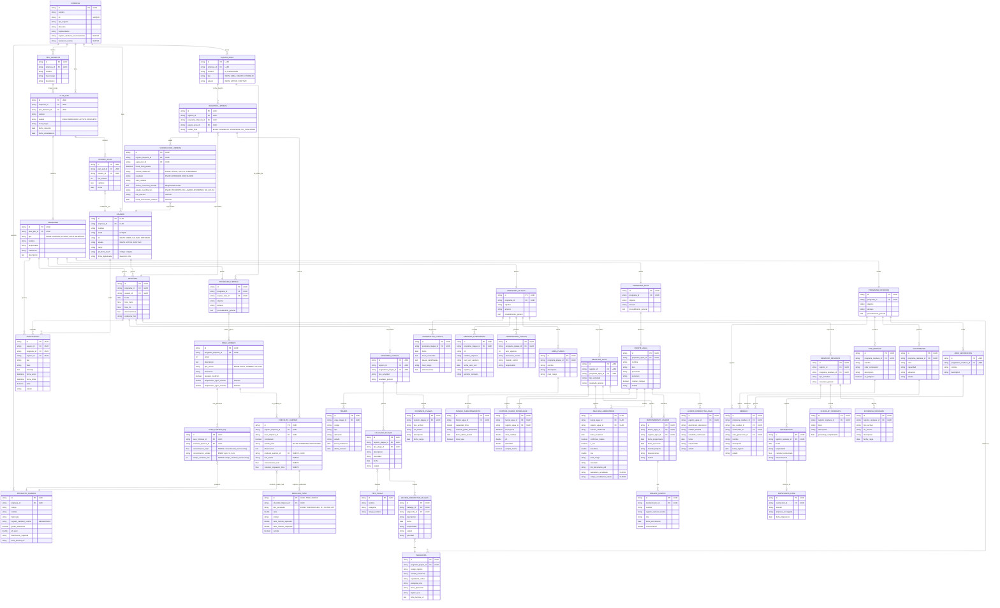

```mermaid
---
config:
  layout: elk
---
erDiagram
    %% ─── GENERAL, IDENTIDAD Y USUARIOS ───
    EMPRESA {
        string id PK "UUID"
        string nombre
        string nit "UNIQUE"
        string tipo_negocio
        string direccion
        string representante
        string registro_sanitario_funcionamiento "NUEVO"
        string resolucion_invima "NUEVO"
    }

    TIPO_ALIMENTO {
        string id PK "UUID"
        string empresa_id FK "UUID"
        string nombre
        string nivel_riesgo
        string descripcion
    }

    PLAN_PSB {
        string id PK "UUID"
        string empresa_id FK "UUID"
        string tipo_alimento_id FK "UUID"
        string version
        string estado "ENUM: BORRADOR, ACTIVO, OBSOLETO"
        string nivel_riesgo
        date fecha_creacion
        date fecha_actualizacion
    }

    PROGRAMA {
        string id PK "UUID"
        string plan_psb_id FK "UUID"
        string tipo "ENUM: LIMPIEZA, PLAGAS, AGUA, RESIDUOS"
        string nombre
        string responsable
        string frecuencia
        text descripcion
    }

    USUARIO {
        string id PK "UUID"
        string empresa_id FK "UUID"
        string nombre
        string email "UNIQUE"
        string rol "ENUM: ADMIN, CALIDAD, OPERARIO"
        string estado "ENUM: ACTIVO, INACTIVO"
        string cargo
        string pin_firma_hash "Código 4 dígitos"
        string firma_digitalizada "Base64 o URL"
    }

    VERSION_PLAN {
        string id PK "UUID"
        string plan_psb_id FK "UUID"
        string usuario_id FK "UUID"
        int nro_version
        text cambios
        date fecha
    }

    NOTIFICACION {
        string id PK "UUID"
        string usuario_id FK "UUID"
        string programa_id FK "UUID"
        string registro_id FK "UUID"
        string tipo
        string titulo
        text mensaje
        datetime fecha_envio
        datetime fecha_limite
        boolean leida
        string estado
    }

    %% ─── REGISTRO BASE (MAESTRO DIARIO) ───
    REGISTRO {
        string id PK "UUID"
        string programa_id FK "UUID"
        string usuario_id FK "UUID"
        date fecha
        time hora_inicio
        time hora_fin
        text observaciones
        string evidencia_foto
    }

    %% ─── MÓDULO LIMPIEZA E INFRAESTRUCTURA ───
    EQUIPO_AREA {
        string id PK "UUID"
        string empresa_id FK "UUID"
        string nombre "Ej. Pasteurizador"
        string tipo "ENUM: AREA, EQUIPO, UTENSILIO"
        string estado "ENUM: ACTIVO, INACTIVO"
    }

    PROGRAMA_LIMPIEZA {
        string id PK "UUID"
        string programa_id FK "UUID"
        string equipo_area_id FK "UUID"
        string objetivo
        string alcance
        text procedimiento_general
    }

    REGISTRO_LIMPIEZA {
        string id PK "UUID"
        string registro_id FK "UUID"
        string programa_limpieza_id FK "UUID"
        string equipo_area_id FK "UUID"
        string estado_final "ENUM: PENDIENTE, CONFORME, NO_CONFORME"
    }

    PASO_LIMPIEZA {
        string id PK "UUID"
        string programa_limpieza_id FK "UUID"
        int orden
        text descripcion
        string tipo_accion "ENUM: SECA, HUMEDA, CIP, COP"
        string frecuencia
        boolean requiere_medicion
        double temperatura_agua_minima "NUEVO"
        double temperatura_agua_maxima "NUEVO"
    }

    PRODUCTO_QUIMICO {
        string id PK "UUID"
        string empresa_id FK "UUID"
        string codigo
        string nombre
        string fabricante
        string registro_sanitario_invima "OBLIGATORIO"
        boolean grado_alimenticio
        double ph_puro
        string dosificacion_sugerida
        string ficha_tecnica_url
    }

    PASO_LIMPIEZA_PQ {
        string id PK "UUID"
        string paso_limpieza_id FK "UUID"
        string producto_quimico_id FK "UUID"
        float concentracion_valor "ANTES: concentracion_teorica string"
        string concentracion_unidad "ENUM: ppm, %, mL/L"
        int tiempo_contacto_min "ANTES: tiempo_contacto_teorico string"
    }

    CHECKLIST_LIMPIEZA {
        string id PK "UUID"
        string registro_limpieza_id FK "UUID"
        string paso_limpieza_id FK "UUID"
        boolean completado
        string estado_paso "ENUM: APROBADO, RECHAZADO"
        text observacion
        string producto_quimico_id FK "NUEVO - UUID"
        string lote_usado "NUEVO"
        float concentracion_real "NUEVO"
        float volumen_preparado_litros "NUEVO"
    }

    MEDICION_PASO {
        string id PK "UUID - TABLA NUEVA"
        string checklist_limpieza_id FK "UUID"
        string tipo_parametro "ENUM: TEMPERATURA, PH, CLORO, ATP"
        double valor
        string unidad
        double valor_minimo_esperado
        double valor_maximo_esperado
        boolean cumple
    }

    VERIFICACION_LIMPIEZA {
        string id PK "UUID"
        string registro_limpieza_id FK "UUID"
        string supervisor_id FK "UUID"
        datetime fecha_hora_prueba
        string metodo_validacion "ENUM: VISUAL, ATP, PH, ALERGENOS"
        string resultado "ENUM: APROBADO, RECHAZADO"
        string valor_medido
        text accion_correctora_tomada "REQUISITO LEGAL"
        string estado_reverificacion "ENUM: PENDIENTE, RE_LAVADO_APROBADO, NO_APLICA"
        string lote_reactivo "NUEVO"
        date fecha_vencimiento_reactivo "NUEVO"
    }

    %% ─── MÓDULO PLAGAS ───
    PROGRAMA_PLAGAS {
        string id PK "UUID"
        string programa_id FK "UUID"
        string objetivo
        string alcance
        text procedimiento_general
    }

    REGISTRO_PLAGAS {
        string id PK "UUID"
        string registro_id FK "UUID"
        string programme_plagas_id FK "UUID"
        string tipo_actividad
        string resultado_general
    }

    DIAGNOSTICO_PLAGAS {
        string id PK "UUID"
        string programa_plagas_id FK "UUID"
        date fecha
        text areas_evaluadas
        text plagas_identificadas
        string nivel_riesgo
        text observaciones
    }

    EMPRESA_FUMIGADORA {
        string id PK "UUID"
        string programa_plagas_id FK "UUID"
        string nit
        string nombre_empresa
        string num_cert_sanitario
        date fecha_venc_cert
        string registro_sds
        string telefono_contacto
    }

    CRONOGRAMA_PLAGAS {
        string id PK "UUID"
        string programa_plagas_id FK "UUID"
        int anio_vigencia
        string frecuencia_control
        string metodo_control
        string responsable
    }

    AREA_PLAGAS {
        string id PK "UUID"
        string programa_plagas_id FK "UUID"
        string nombre
        string descripcion
        string nivel_riesgo
    }

    TRAMPA {
        string id PK "UUID"
        string area_plagas_id FK "UUID"
        string codigo
        string tipo
        string ubicacion
        string estado
        date fecha_instalacion
        date ultima_revision
    }

    TIPO_PLAGA {
        string id PK "UUID"
        string nombre
        string categoria
        string riesgo_sanitario
    }

    HALLAZGO_PLAGAS {
        string id PK "UUID"
        string registro_plagas_id FK "UUID"
        string tipo_plaga_id FK "UUID"
        string descripcion
        string severidad
        date fecha
        string estado
    }

    PLAGUICIDA {
        string id PK "UUID"
        string programa_plagas_id FK "UUID"
        string codigo_registro
        string nombre_comercial
        string ingrediente_activo
        string categoria_oms
        string dosis_aplicacion
        string registro_ica
        text ficha_tecnica_url
    }

    ACCION_CORRECTIVA_PLAGAS {
        string id PK "UUID"
        string hallazgo_id FK "UUID"
        string plaguicida_id FK "UUID"
        string descripcion
        date fecha
        string responsable
        string estado
        string prioridad
    }

    EVIDENCIA_PLAGAS {
        string id PK "UUID"
        string registro_plagas_id FK "UUID"
        string tipo_archivo
        string url_archivo
        string descripcion
        date fecha_carga
    }

    %% ─── MÓDULO AGUA ───
    PROGRAMA_AGUA {
        string id PK "UUID"
        string programa_id FK "UUID"
        string objetivo
        string alcance
        text procedimiento_general
    }

    REGISTRO_AGUA {
        string id PK "UUID"
        string registro_id FK "UUID"
        string programa_agua_id FK "UUID"
        string tipo_actividad
        string resultado_general
    }

    FUENTE_AGUA {
        string id PK "UUID"
        string programa_agua_id FK "UUID"
        string nombre
        string tipo
        string proveedor
        string ubicacion
        boolean requiere_tanque
        string estado
    }

    TANQUE_ALMACENAMIENTO {
        string id PK "UUID"
        string fuente_agua_id FK "UUID"
        double capacidad_litros
        string material_grado_alimenticio
        date fecha_ultimo_lavado
        boolean tiene_tapa
    }

    CONTROL_DIARIO_POTABILIDAD {
        string id PK "UUID"
        string fuente_agua_id FK "UUID"
        string registro_agua_id FK "UUID"
        datetime fecha_hora
        double cloro_residual
        double ph
        double turbiedad
        boolean cumple_norma
    }

    ANALISIS_LABORATORIO {
        string id PK "UUID"
        string fuente_agua_id FK "UUID"
        string registro_agua_id FK "UUID"
        string numero_certificado
        date fecha_muestreo
        boolean coliformes_totales
        boolean e_coli
        double mesofilos
        double irca
        string nivel_riesgo
        string resultado
        string link_documento_pdf
        string laboratorio_acreditado "NUEVO"
        string codigo_acreditacion_ideam "NUEVO"
    }

    MANTENIMIENTO_LAVADO {
        string id PK "UUID"
        string fuente_agua_id FK "UUID"
        string registro_agua_id FK "UUID"
        date fecha_programada
        date fecha_ejecucion
        string metodo_limpieza
        string observaciones
        string estado
    }

    INSUMO_QUIMICO {
        string id PK "UUID"
        string mantenimiento_id FK "UUID"
        string nombre
        string registro_sanitario_invima
        string lote
        date fecha_vencimiento
        double concentracion
    }

    ACCION_CORRECTIVA_AGUA {
        string id PK "UUID"
        string registro_agua_id FK "UUID"
        string descripcion_desviacion
        string medida_tomada
        string resultado_verificacion
        date fecha
        string responsable
        string estado
    }

    %% ─── MÓDULO RESIDUOS ───
    PROGRAMA_RESIDUOS {
        string id PK "UUID"
        string programa_id FK "UUID"
        string objetivo
        string alcance
        text procedimiento_general
    }

    REGISTRO_RESIDUOS {
        string id PK "UUID"
        string registro_id FK "UUID"
        string programa_residuos_id FK "UUID"
        string tipo_actividad
        string resultado_general
    }

    TIPO_RESIDUO {
        string id PK "UUID"
        string programa_residuos_id FK "UUID"
        string nombre
        string color_contenedor
        string descripcion
        boolean es_peligroso
    }

    CONTENEDOR {
        string id PK "UUID"
        string programa_residuos_id FK "UUID"
        string color
        string capacidad
        string ubicacion
        string estado
    }

    AREA_GENERACION {
        string id PK "UUID"
        string programme_residuos_id FK "UUID"
        string nombre
        string descripcion
    }

    RESIDUO {
        string id PK "UUID"
        string programa_residuos_id FK "UUID"
        string tipo_residuo_id FK "UUID"
        string contenedor_id FK "UUID"
        string area_generacion_id FK "UUID"
        string nombre
        string descripcion
        date fecha_registro
        string estado
    }

    RECOLECCION {
        string id PK "UUID"
        string registro_residuos_id FK "UUID"
        date fecha
        string responsable
        float cantidad_recolectada
        string observaciones
    }

    DISPOSICION_FINAL {
        string id PK "UUID"
        string recoleccion_id FK "UUID"
        string metodo
        string empresa_encargada
        date fecha_disposicion
    }

    CHECKLIST_RESIDUOS {
        string id PK "UUID"
        string registro_residuos_id FK "UUID"
        string titulo
        string descripcion
        float porcentaje_cumplimiento
    }

    EVIDENCIA_RESIDUOS {
        string id PK "UUID"
        string registro_residuos_id FK "UUID"
        string tipo_archivo
        string url_archivo
        string descripcion
        date fecha_carga
    }

    %% ─── RELACIONES GENERALES ───
    EMPRESA ||--o{ TIPO_ALIMENTO : "fabrica"
    EMPRESA ||--o{ PLAN_PSB : "tiene"
    EMPRESA ||--o{ USUARIO : "tiene"
    EMPRESA ||--o{ EQUIPO_AREA : "posee"
    EMPRESA ||--o{ PRODUCTO_QUIMICO : "autoriza"
    TIPO_ALIMENTO ||--o{ PLAN_PSB : "origen_riesgo"
    PLAN_PSB ||--|{ PROGRAMA : "contiene"
    PLAN_PSB ||--o{ VERSION_PLAN : "historial"
    VERSION_PLAN }o--|| USUARIO : "modificado_por"
    PROGRAMA ||--o{ REGISTRO : "ejecuta"
    PROGRAMA ||--o{ NOTIFICACION : "genera"
    USUARIO ||--o{ REGISTRO : "genera"
    USUARIO ||--o{ NOTIFICACION : "recibe"
    REGISTRO ||--o{ NOTIFICACION : "resultado"

    %% ─── RELACIONES LIMPIEZA ───
    PROGRAMA ||--|| PROGRAMA_LIMPIEZA : "detalle"
    EQUIPO_AREA ||--o{ PROGRAMA_LIMPIEZA : "es_objeto_de"
    EQUIPO_AREA ||--o{ REGISTRO_LIMPIEZA : "recibe_lavado"
    PROGRAMA_LIMPIEZA ||--o{ PASO_LIMPIEZA : "define_pasos"
    PASO_LIMPIEZA ||--o{ PASO_LIMPIEZA_PQ : "usa_producto"
    PASO_LIMPIEZA_PQ }o--|| PRODUCTO_QUIMICO : "producto"
    REGISTRO ||--o{ REGISTRO_LIMPIEZA : "especializa"
    REGISTRO_LIMPIEZA ||--o{ CHECKLIST_LIMPIEZA : "verifica"
    PASO_LIMPIEZA ||--o{ CHECKLIST_LIMPIEZA : "se_evalua_en"
    CHECKLIST_LIMPIEZA }o--|| PRODUCTO_QUIMICO : "producto_usado_real"
    CHECKLIST_LIMPIEZA ||--o{ MEDICION_PASO : "registra_mediciones"
    REGISTRO_LIMPIEZA ||--o{ VERIFICACION_LIMPIEZA : "valida"
    VERIFICACION_LIMPIEZA }o--|| USUARIO : "responsable"

    %% ─── RELACIONES PLAGAS ───
    PROGRAMA ||--|| PROGRAMA_PLAGAS : "detalle"
    PROGRAMA_PLAGAS ||--o{ DIAGNOSTICO_PLAGAS : "diagnostica"
    PROGRAMA_PLAGAS ||--o{ EMPRESA_FUMIGADORA : "contrata"
    PROGRAMA_PLAGAS ||--o{ CRONOGRAMA_PLAGAS : "planifica"
    PROGRAMA_PLAGAS ||--o{ AREA_PLAGAS : "cubre"
    PROGRAMA_PLAGAS ||--o{ PLAGUICIDA : "referencia"
    AREA_PLAGAS ||--o{ TRAMPA : "contiene"
    REGISTRO ||--o{ REGISTRO_PLAGAS : "especializa"
    REGISTRO_PLAGAS ||--o{ HALLAZGO_PLAGAS : "genera"
    REGISTRO_PLAGAS ||--o{ EVIDENCIA_PLAGAS : "adjunta"
    HALLAZGO_PLAGAS }o--|| TIPO_PLAGA : "clasifica"
    HALLAZGO_PLAGAS ||--o{ ACCION_CORRECTIVA_PLAGAS : "origina"
    ACCION_CORRECTIVA_PLAGAS }o--|| PLAGUICIDA : "usa"

    %% ─── RELACIONES AGUA ───
    PROGRAMA ||--|| PROGRAMA_AGUA : "detalle"
    PROGRAMA_AGUA ||--o{ FUENTE_AGUA : "abastece"
    FUENTE_AGUA ||--o| TANQUE_ALMACENAMIENTO : "almacena"
    FUENTE_AGUA ||--o{ CONTROL_DIARIO_POTABILIDAD : "controla"
    FUENTE_AGUA ||--o{ ANALISIS_LABORATORIO : "analiza"
    FUENTE_AGUA ||--o{ MANTENIMIENTO_LAVADO : "mantiene"
    MANTENIMIENTO_LAVADO ||--o{ INSUMO_QUIMICO : "usa"
    REGISTRO ||--o{ REGISTRO_AGUA : "especializa"
    REGISTRO_AGUA ||--o{ CONTROL_DIARIO_POTABILIDAD : "registra"
    REGISTRO_AGUA ||--o{ ANALISIS_LABORATORIO : "registra"
    REGISTRO_AGUA ||--o{ MANTENIMIENTO_LAVADO : "registra"
    REGISTRO_AGUA ||--o{ ACCION_CORRECTIVA_AGUA : "genera"

    %% ─── RELACIONES RESIDUOS ───
    PROGRAMA ||--|| PROGRAMA_RESIDUOS : "detalle"
    PROGRAMA_RESIDUOS ||--o{ TIPO_RESIDUO : "clasifica"
    PROGRAMA_RESIDUOS ||--o{ CONTENEDOR : "gestiona"
    PROGRAMA_RESIDUOS ||--o{ AREA_GENERACION : "cubre"
    PROGRAMA_RESIDUOS ||--o{ RESIDUO : "registra"
    TIPO_RESIDUO ||--o{ RESIDUO : "tipifica"
    CONTENEDOR ||--o{ RESIDUO : "almacena"
    AREA_GENERACION ||--o{ RESIDUO : "genera"
    REGISTRO ||--o{ REGISTRO_RESIDUOS : "especializa"
    REGISTRO_RESIDUOS ||--o{ RECOLECCION : "registra"
    REGISTRO_RESIDUOS ||--o{ CHECKLIST_RESIDUOS : "verifica"
    REGISTRO_RESIDUOS ||--o{ EVIDENCIA_RESIDUOS : "adjunta"
    RECOLECCION ||--o| DISPOSICION_FINAL : "termina_en"
```